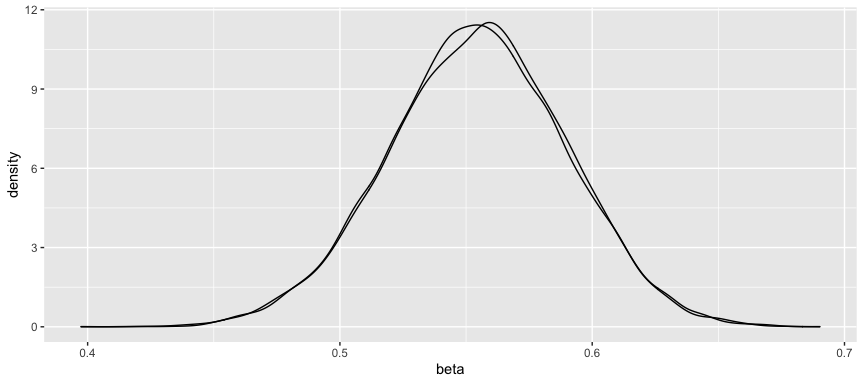

Chapter 3 Exercises: Sampling the Imaginary
================

**Setup**  
For the next few questions, we have been supplied a posterior. From this
posterior, we will make calculations to answer a series of questions.
This posterior is defined below.

``` r
library(ggplot2)
```

    ## Warning: replacing previous import 'vctrs::data_frame' by 'tibble::data_frame'
    ## when loading 'dplyr'

``` r
p_grid <- seq(0,1,length.out=1000)
prior <- rep(1,1000)
likelihood <- dbinom(6,9,prob=p_grid)
posterior <- likelihood*prior
posterior <- posterior/sum(posterior)

set.seed(100)
samples <- data.frame(value=sample(p_grid,posterior,size=10000,replace=TRUE))
ggplot(samples,aes(x=value)) + geom_density() + xlab('Probability') + ylab('Density') + scale_x_continuous(labels=scales::percent)
```

<!-- -->

**Question E1:**  
How much posterior probability lies below p = 0.2?

**Answer E1:**  
To answer this, we simply sum the area of the posterior below 0.2. When
we do this, we find the probability to be around 0.04%.

``` r
ggplot(samples,aes(x=value)) + geom_density() + xlab('Probability') + ylab('Density') + scale_x_continuous(labels=scales::percent) + geom_vline(xintercept=0.2,linetype='dashed',colour='red')
```

<!-- -->

``` r
(sum(samples$value < 0.2)/10000)*100
```

    ## [1] 0.04

-----

-----

**Question E2:**  
How much posterior probability lies above p = 0.8?

**Answer E2:**  
To answer this, we simply use the same method above but change our
conditional statement within the sum function. Now, we are simply
summing the total area to the right of the red line below.

When we do this, we find this probability to be approximately 11.16%.

``` r
ggplot(samples,aes(x=value)) + geom_density() + xlab('Probability') + ylab('Density') + scale_x_continuous(labels=scales::percent) + geom_vline(xintercept=0.8,linetype='dashed',colour='red')
```

<!-- -->

``` r
(sum(samples$value > 0.8)/10000)*100
```

    ## [1] 11.16

-----

-----

**Question E3:**  
How much posterior probability lies between p = 0.2 and p = 0.8?

**Answer E3:**  
Now, we are simply summing the area between the two red lines plotted
below. As a result, there is an 88.8% chance that our probability lies
between 0.2 and 0.8.

``` r
ggplot(samples,aes(x=value)) + geom_density() + xlab('Probability') + ylab('Density') + scale_x_continuous(labels=scales::percent) + geom_vline(xintercept=0.2,linetype='dashed',colour='red') + geom_vline(xintercept=0.8,linetype='dashed',colour='red')
```

<!-- -->

``` r
(sum(samples$value > 0.2 & samples$value < 0.8)/10000)*100
```

    ## [1] 88.8

-----

-----

**Question E4:**  
20% of the posterior probability lies below which value of p?

**Answer E4:**  
Note that this is the different question than before. Now we would like
to know at which point the area below it is equal to \~20%. This answer
is \~ 0.5185.

``` r
percentile <- quantile(samples$value,0.2)

ggplot(samples,aes(x=value)) + geom_density() + xlab('Probability') + ylab('Density') + scale_x_continuous(labels=scales::percent) + geom_vline(xintercept=percentile,linetype='dashed',colour='red')
```

<!-- -->

``` r
percentile
```

    ##       20% 
    ## 0.5185185

-----

-----

**Question E5:**  
20% of the posterior probability lies above which value of p?

**Answer E5:**  
Essentially, we are being asked “80% of the posterior probability lies
below which value of p?” as we know that 1-0.2 = 0.8. The answer is \~
`quantile(samples$value,0.8)`

``` r
percentile <- quantile(samples$value,0.8)

ggplot(samples,aes(x=value)) + geom_density() + xlab('Probability') + ylab('Density') + scale_x_continuous(labels=scales::percent) + geom_vline(xintercept=percentile,linetype='dashed',colour='red')
```

<!-- -->

``` r
percentile
```

    ##       80% 
    ## 0.7557558

-----

-----

**Question E6:**  
Which values of p contain the narrowest interval equal to 66% of the
posterior probabilty?

**Answer E6:**  
To answer this, we must calculate the HDPI (highest posterior density
interval). Although this sounds complicated, R makes this very simple to
do.

``` r
library(rethinking)
```

    ## Loading required package: rstan

    ## Loading required package: StanHeaders

    ## rstan (Version 2.21.2, GitRev: 2e1f913d3ca3)

    ## For execution on a local, multicore CPU with excess RAM we recommend calling
    ## options(mc.cores = parallel::detectCores()).
    ## To avoid recompilation of unchanged Stan programs, we recommend calling
    ## rstan_options(auto_write = TRUE)

    ## Loading required package: parallel

    ## rethinking (Version 2.13)

    ## 
    ## Attaching package: 'rethinking'

    ## The following object is masked from 'package:stats':
    ## 
    ##     rstudent

``` r
HPDI(samples$value,prob=0.66)  
```

    ##     |0.66     0.66| 
    ## 0.5085085 0.7737738

Above, we can see that the HDPI implies that the narrowest interval
containing 66% of the interval is `HPDI(samples$value,prob=0.66)`. Let
us now compare this to the estimate we’d make if we simply used the
percentile compatability interval.

``` r
PI(samples$value,prob=0.66)
```

    ##       17%       83% 
    ## 0.5025025 0.7697698

As we might expect, these numbers are slightly different but mostly the
same. This is expected, as the posterior distribution is nearly
Gaussian. If our distribution was not nearly Gaussian, we’d expect these
numbers to differ drastically.

<!-- -->

-----

-----

**Question M1-2:**  
Suppose the globe tossing data had turned out to be 8 water in 15
tosses. Construct the posterior distribution, using grid approximation.
Use the same flat prior as before. Next, draw 10,000 samples and use the
samples to calculate the 90% HDPI for p. 

**Answer M1-M2:**  
To do this, we simply create a new likelihood value and multiply it by
the same prior as before. Below, I calculate both the previous and
current posterior distribution and then plot them side-by-side.

``` r
p_grid <- seq(0,1,length.out=1000)
prior <- rep(1,1000)

likelihood1 <- dbinom(6,9,prob=p_grid)
likelihood2 <- dbinom(8,15,prob=p_grid)

posterior1 <- likelihood1*prior
posterior1 <- posterior1/sum(posterior1)

posterior2 <- likelihood2*prior
posterior2 <- posterior2/sum(posterior2)

set.seed(100)
sample1 <- data.frame(value=sample(p_grid,posterior1,size=10000,replace=TRUE))
sample1$model <- '6 successes from 9'
sample2 <- data.frame(value=sample(p_grid,posterior2,size=10000,replace=TRUE))
sample2$model <- '8 successes from 15'

samples <- rbind(sample1,sample2)
ggplot(samples,aes(x=value,fill=model)) + geom_density(alpha=0.2) + theme(legend.position='bottom',legend.title=element_blank())
```

<!-- -->

Now, lets calculate the 90% HDPI for both distributions to understand
how much our estimates can change with slightly different likelihoods.

``` r
HPDI(sample1$value,prob=0.90)  
```

    ##      |0.9      0.9| 
    ## 0.4144144 0.8638639

``` r
HPDI(sample2$value,prob=0.90)  
```

    ##      |0.9      0.9| 
    ## 0.3293293 0.7167167

The 90% HDPI for the new distribution is 0.3293293, 0.7167167 while the
90% HDPI for the previous posterior was 0.4144144, 0.8638639.

**Hard 1:**  
Using grid approximation, compute the posterior distribution for the
probability of a birth being a boy. Assume a uniform prior probability.
Which parameter value maximizes the posterior probability?

``` r
library(rethinking)
data(homeworkch3)

## from data, calculate likelihood of a boy
boys <- (sum(birth1)+sum(birth2))
trials <- (length(birth1)+length(birth2))

p_grid <- seq(0,1,length.out=1000)
prior <- rep(1,1000)

likelihood <- dbinom(boys,trials,prob=p_grid)
posterior <- likelihood*prior

posterior <- posterior/sum(posterior)

plot(p_grid,posterior)
```

<!-- -->

``` r
p_grid[which.max(posterior)]
```

    ## [1] 0.5545546

From the code above, we find that the p that maximizes the posterior is
0.5545546

**Hard 2:**  
Using the sample function, draw 10k random parameter values from the
posterior distribution you calculated above. Use these samples to
estimate the 50%, 89%, and 97% highest posterior density intervals.

**Answer 2**:  
Immediately below, I have plotted the distribution of the posterior we
generated above. Additionally, I’ve used the beta distribution (the
conjugate) to validate my posterior generated above. You can see that
these distributions are nearly identical.

``` r
library(ggplot2)

sample <- data.frame(value=rbinom(10000,size=trials,prob=p_grid[which.max(posterior)]),beta=rbeta(10000,boys,trials-boys))
sample$percentage <- sample$value/200

ggplot(sample) + geom_density(aes(x=beta)) + geom_density(aes(x=percentage))
```

<!-- -->

Now, let us go about calculating the HDPI.

``` r
library(rethinking)

HPDI(sample$percentage,0.5)
```

    ##  |0.5  0.5| 
    ## 0.520 0.565

``` r
HPDI(sample$percentage,0.89)
```

    ## |0.89 0.89| 
    ## 0.495 0.605

``` r
HPDI(sample$percentage,0.97)
```

    ## |0.97 0.97| 
    ## 0.475 0.625

Above, we find that the HPDI for the following are:

50%: 0.52, 0.565  
89%: 0.495, 0.605  
97%: 0.475, 0.625

Additionally, because our posterior is nearly gaussian, we can use a
simple quantile function to roughly estimate the above.

``` r
quantile(sample$percentage,c(0.5/2,1-(0.5/2)))
```

    ##  25%  75% 
    ## 0.53 0.58

``` r
quantile(sample$percentage,c(.11/2,1-(.11/2)))
```

    ##  5.5% 94.5% 
    ##  0.50  0.61

``` r
quantile(sample$percentage,c(0.03/2,1-(0.03/2)))
```

    ##  1.5% 98.5% 
    ## 0.475 0.630

50%: 0.53, 0.58  
89%: 0.5, 0.61  
97%: 0.475, 0.63

We can see that these estimates are nearly identical to those above.
However, if our posterior was not gaussian, this would not be the case.
